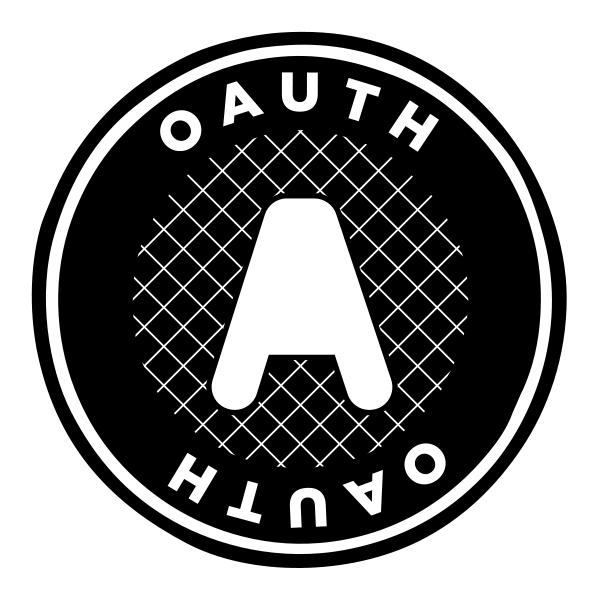

# OAuth

In this OAuth authentication project, the authorization grant type "authorization code" was adopted, which allows users to grant permissions so that third-party systems can access and use information in their systems. The authentication flow was developed following the specifications established by the IETF (Internet Engineering Task Force) in RFC 6749. In this way, compliance with international standards for OAuth authentication is guaranteed.

This project was implemented using the Nest.js framework, in order to simplify its construction. For user authentication, a simple HTML page was created so that the user can login to the system and generate the authorization code. When the user provides his information in the HTML page, it is sent to the backend, which generates a URL and redirects the user to the page specified by the client in the redirect_url query. This process allows the user to access the system in a secure and efficient manner.
